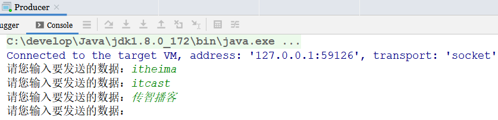
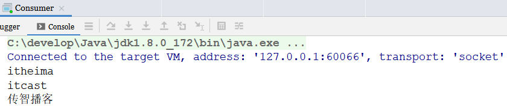
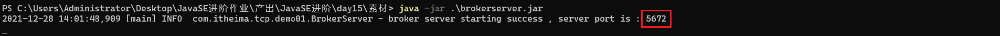
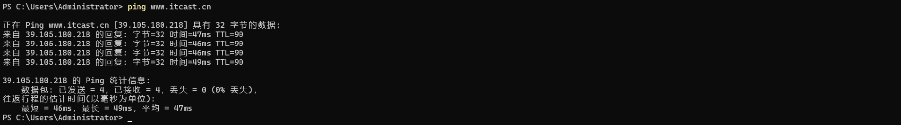
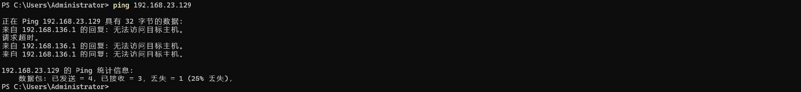
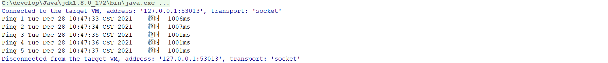
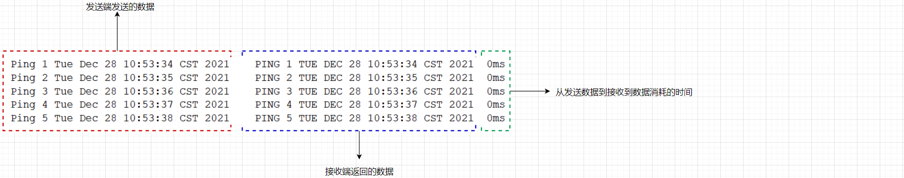

# 1 简答题

## 1.1 简答题一

简述网络编程三要素以及它们的含义？

```shell
答：
```

## 1.2 简答题二

简述ipv4和ipv6的组成规则？

```shell
答：
```

## 1.3 简答题三

简述UDP协议和TCP协议的特点？

```shell
答：
```

## 1.4 简答题四

简述三次握手过程？

提示：

1、从数据传输方式进行说明

2、可以使用wireshark抓包工具抓取数据传输的过程

3、wireshark软件的使用在素材文件夹(Wireshark)中以及提供好了


## 1.5 简答题五

简述四次挥手过程？

提示：

1、从数据传输方式进行说明

2、可以使用wireshark抓包工具抓取数据传输的过程

3、wireshark软件的使用在素材文件夹(Wireshark)中以及提供好了


# 2 编程题

## 2.1 编程题目一

**训练目标**：掌握TCP协议通讯代码书写，以及理解其在实际开发中的应用

**需求背景**：使用TCP协议通讯可以在两个进程之间完成数据的传输，如下图所示：

|  |
| ------------------------------------------------------------ |

可以在接收数据这一端创建一个ServerSocket对象，在发送端创建Socket对象。在进行数据传输的时候是先建立连接形成连接通道，然后实现数据的传输。

这种方式存在一个弊端：两个进程之间的耦合度太高了(假设接收端的ip地址发生了改变此时发送端的代码也需要进行改动)，现需要对上述的程序进行优化以降低两个进程之间的耦合度。

优化的思想：就是在两个进程之间添加一个中间程序，此时在进行数据传输的时候两个进程只需要和中间程序进行交互即可。

如下图所示：

  


**需求描述**：发送端可以将数据发给中间程序(Broker),接收端可以从中间程序(Broker)中获取数据。其中的发送端也可以将其称之为生产者，接收端可以将其称之为消费者。Broker程序在素材文件中已经

提供(brokerserver.jar)。现需要开发生产者程序和消费程序借助于Broker程序完成数据的传输。案例实现效果如下所示：

|  |  |
| ------------------------------------------------------------ | ------------------------------------------------------------ |

生产者键盘录入完数据以后，消费者获取到数据在控制台进行输出。

**实现提示**：

1、先通过`java -jar brokerserver.jar`命令启动中间程序，如下图所示：

|  |
| ------------------------------------------------------------ |

中间程序对外提供的访问端口为：5672

2、生产者程序和消费者程序只需要创建Socket对象和Broker程序进行连接即可

3、为了区分到底是生产者程序还是消费者程序，在启动程序的时候生产者程序启动需要发送一个字符串：**PRODUCER** 给Broker程序; 消费者程序需要发送一个字符串：**CONSUMER** 给Broker程序

4、先启动消费者程序再启动生产者程序进行测试


## 2.2 编程题目二

**训练目标**：掌握UDP协议通讯代码书写，以及理解其在实际开发中的应用

**需求背景**：dos命令ping是用来检测本地计算机是否可以和指定的ip地址的计算机进行正常通讯。使用方式如下所示：

```shell
ping ip地址/域名
```

如果可以进行正常通讯，此时在控制台输出的内容如下所示：

|  |
| ------------------------------------------------------------ |

如果不可以进行正常通讯，此时在控制台输出的内容如下所示：

|  |
| ------------------------------------------------------------ |

**需求描述**：使用UDP协议的通讯来模拟ping命令的执行效果。

①正常通讯，在控制台输出如下内容

|  |
| ------------------------------------------------------------ |

②不能正常通讯，在控制台输出如下内容：

|  |
| ------------------------------------------------------------ |

**实现提示**：

1、实现原理就是发送端每隔1秒向接收端发送数据，然后等待接收端进行数据返回

2、接收端获取到数据以后，将数据转换成大写进行返回

3、如果接收端没有启动，那么此时发送端就无法获取到接收端所发送过来的数据，那么此时提示超时

4、通过调用DatagramSocket中的setSoTimeout设置接收数据的最大等待时间

5、控制台输出了5次内容，因此需要循环5次来实现数据的传输

6、数据格式说明

|  |
| ------------------------------------------------------------ |


