# 1 简答题

## 1.1 简答题一

简述网络编程三要素以及它们的含义？

```shell
答：
①IP地址
  要想让网络中的计算机能够互相通信，必须为每台计算机指定一个标识号，通过这个标识号来指定要接收数据的计算机和识别发送的计算机，而IP地址就是这个标识号。也就是设备的标识
  
② 端口
  网络的通信，本质上是两个应用程序的通信。每台计算机都有很多的应用程序，那么在网络通信时，如何区分这些应用程序呢？如果说IP地址可以唯一标识网络中的设备，那么端口号就可以唯一标   识设备中的应用程序了。也就是应用程序的标识

③协议

  通过计算机网络可以使多台计算机实现连接，位于同一个网络中的计算机在进行连接和通信时需要遵守一定的规则，这就好比在道路中行驶的汽车一定要遵守交通规则一样。在计算机网络中，这些   连接和通信的规则被称为网络通信协议，它对数据的传输格式、传输速率、传输步骤等做了统一规定，通信双方必须同时遵守才能完成数据交换。常见的协议有UDP协议和TCP协议
```

## 1.2 简答题二

简述ipv4和ipv6的组成规则？

```shell
答：
①ipv4
  由一个32位的二进制数据组成，也就是4个字节。例如一个采用二进制形式的IP地址是“11000000 10101000 00000001 01000010”，这么长的地址，处理起来也太费劲了。为了方便使用，IP   地址经常被写成十进制的形式，中间使用符号“.”分隔不同的字节。于是，上面的IP地址可以表示为“192.168.1.66”。IP地址的这种表示法叫做“点分十进制表示法”。
②ipv6
  采用128位地址长度，每16个字节一组，分成8组十六进制数。
```

## 1.3 简答题三

简述UDP协议和TCP协议的特点？

```shell
答：
①UPD协议
  1. UDP协议是一种面向非连接的协议
  2. UDP协议是一种不可靠的协议
  3. UPD协议是基于数据包进行传输,数据包不能超过64K
  4. UDP协议的它的通信效率很高
②TCP协议
  1. TCP协议是一种面向连接的协议
  2. TCP协议是一种可靠的协议
  3. TCP协议是基于IO流进行数据传输,传输数据无大小限制
  4. TCP协议的它的通信效率比较低
```

## 1.4 简答题四

简述三次握手过程？

提示：

1、从数据传输方式进行说明

2、可以使用wireshark抓包工具抓取数据传输的过程

3、wireshark软件的使用在素材文件夹(Wireshark)中以及提供好了

```
答：
借助于工具wireshark来抓取TCP客户端与服务端建立连接时数据传输的过程，对应的测试代码如下所示：
```

客户端代码

```java
// 创建Socket对象
Socket socket = new Socket("169.254.170.6" , 9999) ;   // 169.254.170.6这个地址是安装wireshark的时候产生的本地回环地址

//  让线程休眠60s
TimeUnit.SECONDS.sleep(60);
```

服务端代码

```java
// 创建ServerSocket对象
ServerSocket serverSocket = new ServerSocket(9999) ;

// 让线程休眠60s
TimeUnit.SECONDS.sleep(60);
```

数据传输过程如下所示：

首先运行服务端，然后在运行客户端，在wireshark工具中捕获完整的通信过程，结果如下图所示：

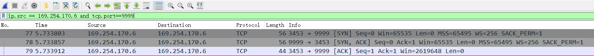 

第一次"握手"如下图所示

 

在第一次"握手"时，客户端向服务端发送SYN标志位，目的是与服务端建立连接。Seq代表sequence number(发送数据流序号), 例如：Seq的值是5,说明在数据流中曾经一共发送了 1, 2, 3，4 这4次数据。而在本次"握手"中, Seq的值是0，代表客户端曾经没有给服务端发送数据。另外Len=0也可以看出来是没有数据可供发送的，客户端仅仅发送一个SYN标志位到服端代表要进行连接。

第二次"握手"如下图所示

 

第二次"握手"时，服务端向客户端发送 SYN ACK 标志位，其中ACK标志位表示是对收到的数据包的确认，说明服务端接收到了客户端的连接。ACK的值是1，表示服务端期待下一次从客户端发送数据流的序列号是1，而Seq=0代表服务端曾经并没有给客户端发送数据，而本次也没有发送数据，因为Len=0也证明了这一点。

第三次"握手"如下图所示

 

第三次“握手”时，客户端向服务端发送的ACK标志位为1, Seq的值是1。Seq=l代表这正是服务端所期望的Ack=1。Len=0说明客户端这次还是没有向服务端传递数据，而客户端向服务端发送ACK 标志位为1的信息，说明客户端期待服务端下一次传送的Seq的值是1。


连接建立过程总结：

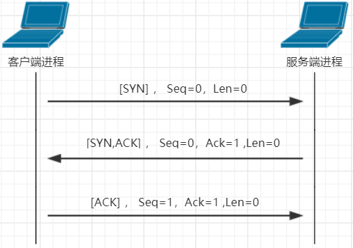 


## 1.5 简答题五

简述四次挥手过程？

提示：

1、从数据传输方式进行说明

2、可以使用wireshark抓包工具抓取数据传输的过程

3、wireshark软件的使用在素材文件夹(Wireshark)中以及提供好了

```
答：
借助于wireshark这个抓包工具来抓取连接断开的整个数据传输的过程。对应的测试代码如下所示：
```

客户端代码

```java
// 创建Socket对象
Socket socket = new Socket("169.254.170.6" , 9999) ;

// 线程休眠
TimeUnit.SECONDS.sleep(30);

// 关闭连接
socket.close();
```

服务端代码

```java
// 创建ServerSocket对象
ServerSocket serverSocket = new ServerSocket(9999) ;

// 获取连接对象
Socket socket = serverSocket.accept();

// 线程休眠
TimeUnit.SECONDS.sleep(30);

// 释放资源
socket.close();
serverSocket.close();
```

首先运行服务端，然后在运行客户端，在wireshark工具中捕获完整的通信过程，结果如下图所示：

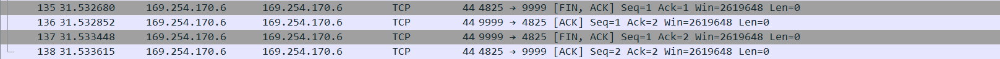 

第一次"挥手"如下图所示

 

在第一次"挥手"时，客户端到服务器发送标志位FIN ACK,告知服务端客户端关闭了。Seq=1表示本次数据流的序号为1，Ack=1表示客户端期望服务端下一次发送的数据流的序号为1。len=0，

说明没有数据传输到服务端。

第二次"挥手"如下图所示

 

在第二次"挥手"时,服务端向客户端发送标志位ACK,Seq=1代表的正是客户端想看的Ack=1。Ack=2表示服务端期望下一次客户端发送的数据流的序号为2。len=0,说明没有数据传输到客户端。

第三次"挥手"如下图所示

 

在第三次"挥手"时,服务端向客户端发送标志位FIN ACK,告知客户端服务端关闭了。Seq=1代表的正是客户端想看的Ack=1。Ack=2表示服务端期望下一次客户端发送的数据流的序号为2。

len=0,说明没有数据传输到客户端。

第四次"挥手"如下图所示

 

在第四次"挥手"时,客户端向服务端发送标志位ACK，告知服务端客户端已经收到服务端关闭信息。Seq=2代表的正是服务端想看的Ack=2，ACK=2表示客户端期望下一次服务端发送的数据流的序

号为2。

连接断开的过程总结：

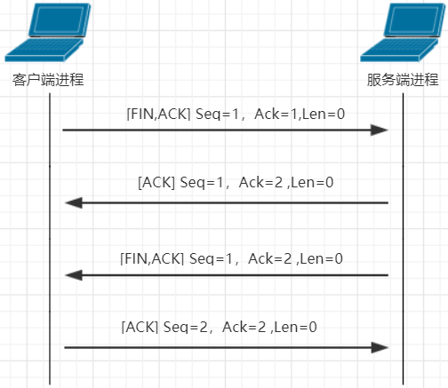   


# 2 编程题

## 2.1 编程题目一

**训练目标**：掌握TCP协议通讯代码书写，以及理解其在实际开发中的应用

**需求背景**：使用TCP协议通讯可以在两个进程之间完成数据的传输，如下图所示：

| 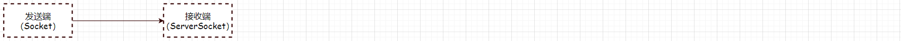 |
| ------------------------------------------------------------ |

可以在接收数据这一端创建一个ServerSocket对象，在发送端创建Socket对象。在进行数据传输的时候是先建立连接形成连接通道，然后实现数据的传输。

这种方式存在一个弊端：两个进程之间的耦合度太高了(假设接收端的ip地址发生了改变此时发送端的代码也需要进行改动)，先需要对上述的程序进行优化以降低两个进程之间的耦合度。

优化的思想：就是在两个进程之间添加一个中间程序，此时在进行数据传输的时候两个进程只需要和中间程序进行交互即可。

如下图所示：

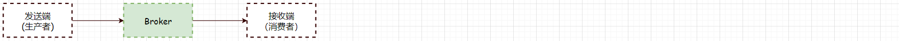 


**需求描述**：发送端可以将数据发给中间程序(Broker),接收端可以从中间程序(Broker)中获取数据。其中的发送端也可以将其称之为生产者，接收端可以将其称之为消费者。Broker程序在素材文件中已经

提供(brokerserver.jar)。现需要开发生产者程序和消费程序借助于Broker程序完成数据的传输。案例实现效果如下所示：

| 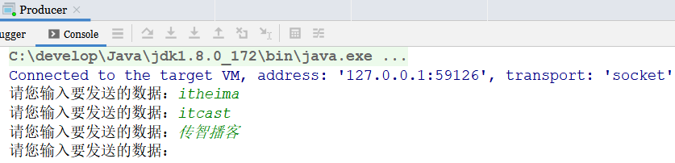 | 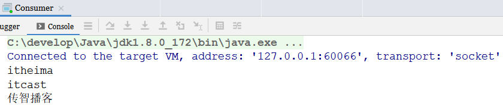 |
| ------------------------------------------------------------ | ------------------------------------------------------------ |

生产者键盘录入完数据以后，消费者获取到数据在控制台进行输出。

**实现提示**：

1、先通过`java -jar brokerserver.jar`命令启动中间程序，如下图所示：

| 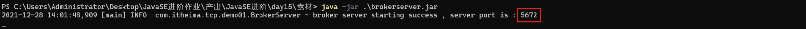 |
| ------------------------------------------------------------ |

中间程序对外提供的访问端口为：5672

2、生产者程序和消费者程序只需要创建Socket对象和Broker程序进行连接即可

3、为了区分到底是生产者程序还是消费者程序，在启动程序的时候生产者程序启动需要发送一个字符串：**PRODUCER** 给Broker程序; 消费者程序需要发送一个字符串：**CONSUMER** 给Broker程序

4、先启动消费者程序再启动生产者程序进行测试

**代码实现**：

①生产者代码

```java
public class Producer {

    public static void main(String[] args) throws IOException {

        // 创建Socket对象
        Socket socket = new Socket("127.0.0.1" , 5672);

        // 获取字节输出流对象并将其转换成高效的字符输出流
        BufferedWriter bw = new BufferedWriter(new OutputStreamWriter(socket.getOutputStream()));

        // 发送PRODUCER数据
        bw.write("PRODUCER");
        bw.newLine();
        bw.flush();

        // 键盘不断录入数据进行业务数据发送
        while(true) {
            Scanner sc = new Scanner(System.in) ;
            System.out.print("请您输入要发送的数据：");
            String line = sc.nextLine();
            bw.write(line);
            bw.newLine();
            bw.flush();
        }

    }
}
```

②消费者代码

```java
public class Consumer {

    public static void main(String[] args) throws IOException {

        // 创建Socket对象
        Socket socket = new Socket("127.0.0.1" , 5672);

        // 获取字节输出流对象并将其转换成高效的字符输出流
        BufferedWriter bw = new BufferedWriter(new OutputStreamWriter(socket.getOutputStream()));

        // 发送PRODUCER数据
        bw.write("CONSUMER");
        bw.newLine();
        bw.flush();

        while(true) {

            // 获取字节输入流对象，并且将其转换成高效的字符输入流
            BufferedReader br = new BufferedReader(new InputStreamReader(socket.getInputStream())) ;
            String line = null ;
            while((line = br.readLine()) != null) {
                System.out.println(line);
            }
        }

    }

}
```


## 2.2 编程题目二

**训练目标**：掌握UDP协议通讯代码书写，以及理解其在实际开发中的应用

**需求背景**：dos命令ping是用来检测本地计算机是否可以和指定的ip地址的计算机进行正常通讯。使用方式如下所示：

```shell
ping ip地址/域名
```

如果可以进行正常通讯，此时在控制台输出的内容如下所示：

|  |
| ------------------------------------------------------------ |

如果不可以进行正常通讯，此时在控制台输出的内容如下所示：

| 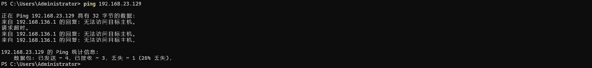 |
| ------------------------------------------------------------ |

**需求描述**：使用UDP协议的通讯来模拟ping命令的执行效果。

①正常通讯，在控制台输出如下内容

| 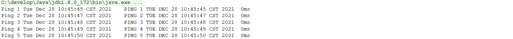 |
| ------------------------------------------------------------ |

②不能正常通讯，在控制台输出如下内容：

| 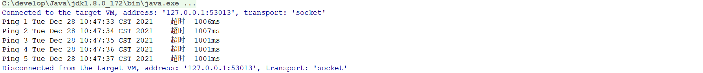 |
| ------------------------------------------------------------ |

**实现提示**：

1、实现原理就是发送端每隔1秒向接收端发送数据，然后等待接收端进行数据返回

2、接收端获取到数据以后，将数据转换成大写进行返回

3、如果接收端没有启动，那么此时发送端就无法获取到接收端所发送过来的数据，那么此时提示超时

4、通过调用DatagramSocket中的setSoTimeout设置接收数据的最大等待时间

5、控制台输出了5次内容，因此需要循环5次来实现数据的传输

6、数据格式说明

| 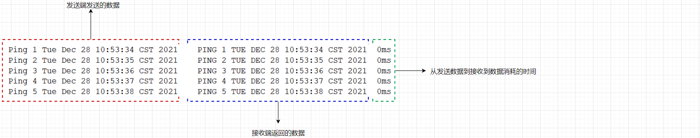 |
| ------------------------------------------------------------ |

**代码实现**：

①接收端代码

```java
public class UdpPingService {

    public static  void main(String[] args) throws Exception {

        // 创建UDP通讯的DatagramSocket对象，并且暴露端口为80
        DatagramSocket datagramSocket = new DatagramSocket(80);

        // 不断读取发送端所发送过来的数据
        while (true) {

            // 创建一个字节数组，用来存储读取到的数据
            byte[] data = new byte[1024];

            // 创建DatagramPacket对象，并且进行数据的读取操作
            DatagramPacket datagramPacket = new DatagramPacket( data , data.length);
            datagramSocket.receive(datagramPacket);

            // 从数据中获取读取到的数据，并将其转换成大写
            String str = new String(data,0 , datagramPacket.getLength(),"UTF-8").toUpperCase();

            // 把读取到的数据转换成字节数组
            byte[] data1 = str.getBytes("UTF-8");

            // 创建DatagramPacket对象封装给发送端要返回的数据
            DatagramPacket datagramPacket1 = new DatagramPacket( data1 , data1.length , datagramPacket.getAddress() , datagramPacket.getPort());

            // 发送数据到发送端
            datagramSocket.send(datagramPacket1);
        }
    }

}
```

②发送端代码

```java
public class UdpPingClient {

    public static void main(String[] args) throws  Exception{

        // 创建DatagramSocket对象，并设置为接收到数据时的超时时间单位为秒
        DatagramSocket datagramSocket = new DatagramSocket();
        datagramSocket.setSoTimeout(1000);

        // 循环5次发送数据
        for(int i = 1 ; i <= 5 ; i++) {

            // 创建需要发送的数据将其封装到datagramPacket对象中，然后调用DatagramSocket对象的send方法发送数据
            String str = "Ping " + i + " " + new Date().toString();
            byte[] data = str.getBytes("UTF-8");
            DatagramPacket datagramPacket = new DatagramPacket(data,data.length, InetAddress.getByName("localhost"),80);
            System.out.print(str + "    ");
            long startTime = System.currentTimeMillis();        // 记录发送数据开始时间
            datagramSocket.send(datagramPacket);

            // 创建DatagramPacket对象来接收接收端返回的数据
            byte[] data1 = new byte[1024];
            DatagramPacket datagramPacket1 = new DatagramPacket(data1 , data1.length);
            try {

                // 接收数据
                datagramSocket.receive(datagramPacket1);

                // 解析数据并将其输出到控制台
                byte[] packet1Data = datagramPacket1.getData();
                long endTime = System.currentTimeMillis();
                String str1 = new String(packet1Data,0 , datagramPacket1.getLength(),"UTF-8");
                System.out.println(str1+"  "+(endTime - startTime) + "ms");

                // 线程休眠1s
                Thread.sleep(1000);

            } catch (IOException e) {

               // 输出超时时信息
               System.out.print("超时");
               long endTime = System.currentTimeMillis();
               System.out.println("  " + (endTime - startTime) + "ms");

            }

        }

    }
}
```


